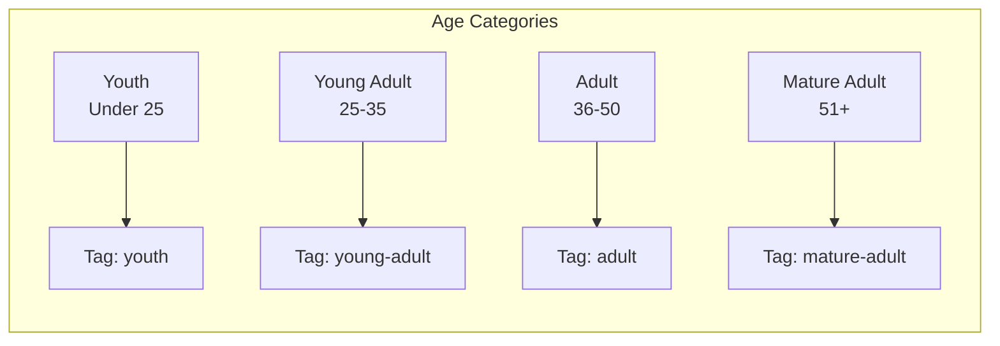
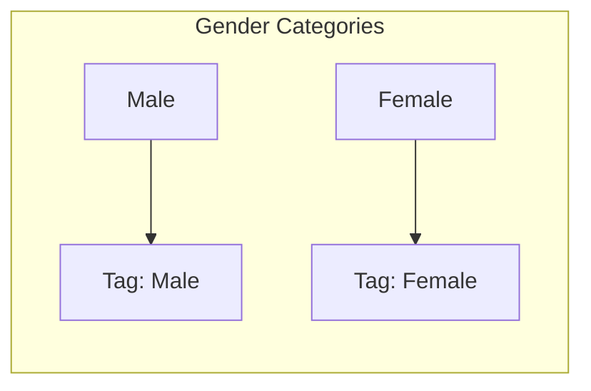
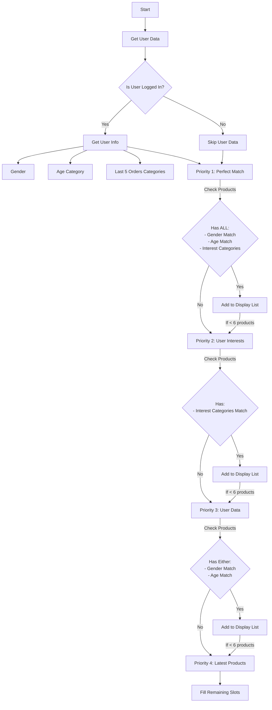
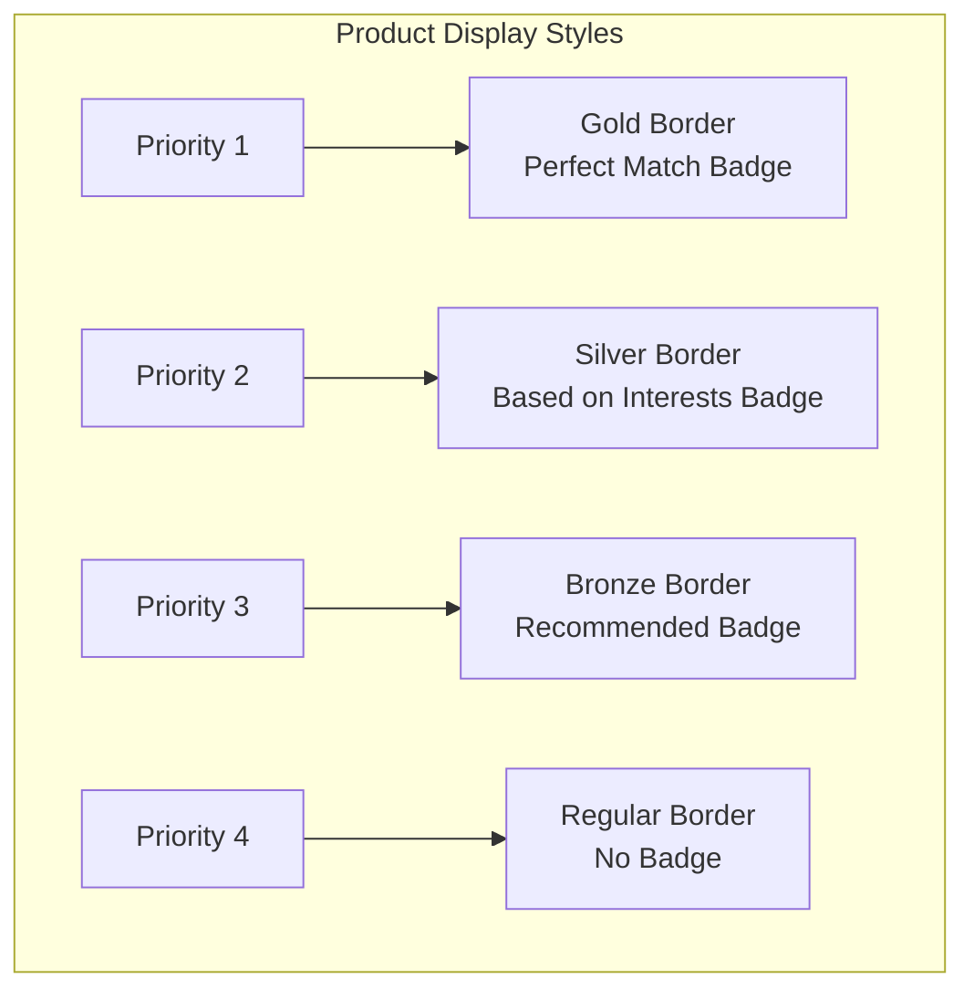
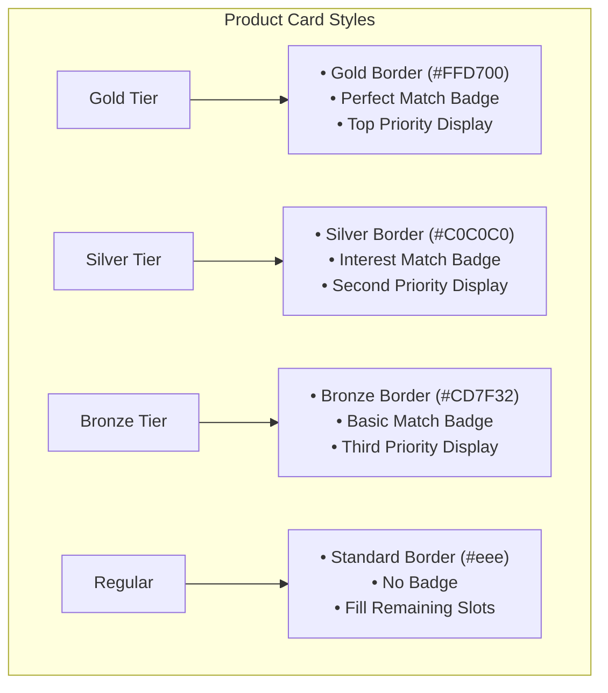

# Product Recommendation Algorithm Documentation

## Overview
This document explains the product recommendation algorithm visualized in the provided flowchart. The algorithm collects user data and determines which products to display based on a prioritized matching system.

## Categories and Tags

## Process Flow

## Visual Indicators

### Data Collection
1. The process begins by collecting user data
2. The system determines the user's age category:
   - Youth: Under 25 years old
   - Young Adult: 25-35 years old
   - Adult: 36-50 years old
   - Mature Adult: Over 50 years old
3. The system captures the user's gender
4. The system extracts interest categories from the user's last 5 orders

### Data Processing
1. All demographic data (age category and gender) is combined with the user's interests
2. This combined data is used to determine which products to display

### Product Display Logic
The system follows a priority-based approach for displaying products:

#### Priority 1
Show products that match ALL of the following criteria:
- User's gender
- User's age category
- User's interest categories

#### Priority 2 (if slots available)
Show products that match:
- User's interest categories only

#### Priority 3 (if slots available)
Show products that match EITHER:
- User's gender, OR
- User's age category

#### Priority 4 (if slots available)
Show the latest products added to the catalog

## Implementation Notes
- The algorithm ensures users always see some product recommendations
- The prioritization system attempts to show the most personalized products first
- If highly personalized matches aren't available, the system gradually broadens the matching criteria
- Maximum of 6 products are displayed in total
- Products are never duplicated across priority levels

## Visual Style Guide

## Next Steps
Consider implementing A/B testing to determine the effectiveness of each priority level in generating conversions.
