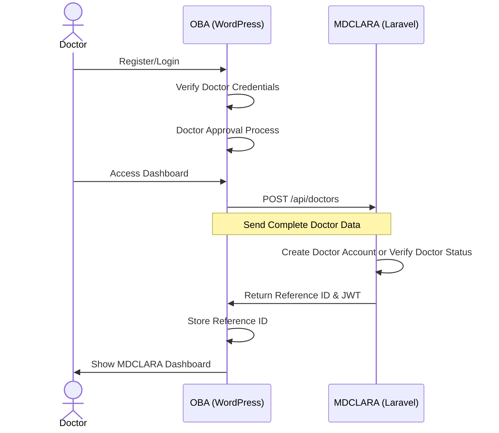
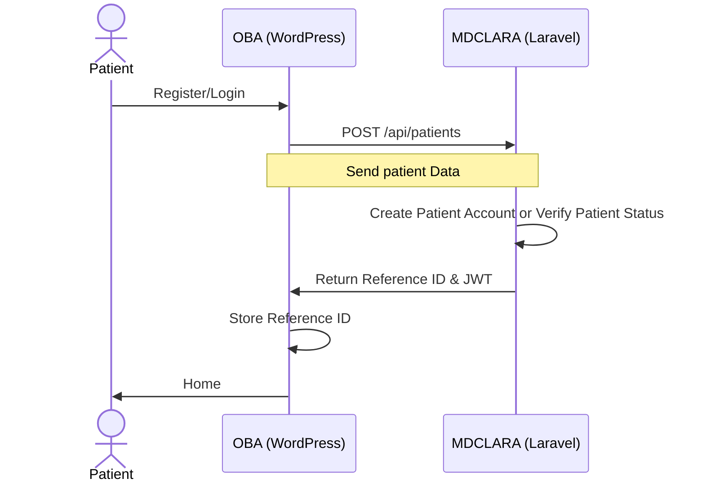
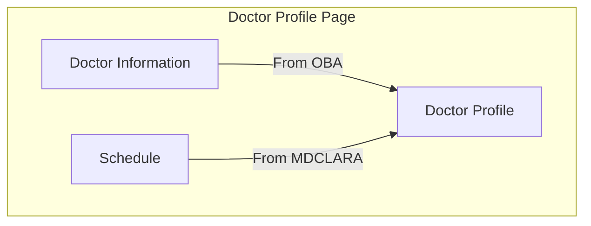
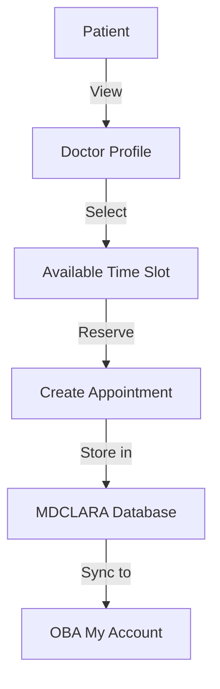
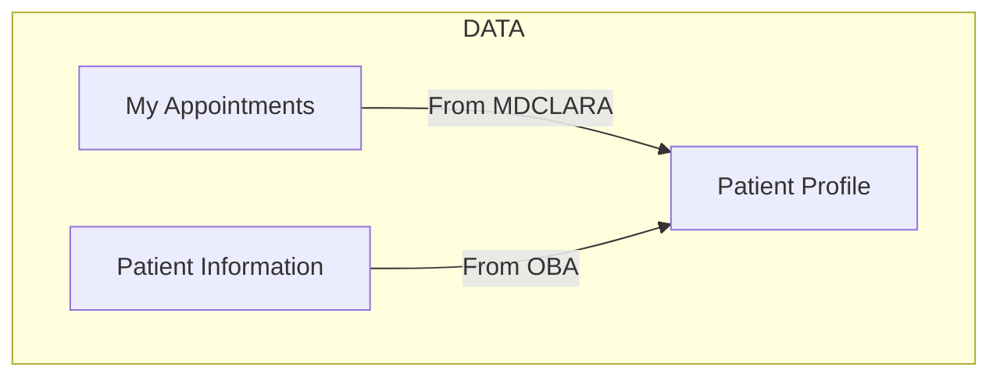

# OBA-MDCLARA System Integration

## 1. SSO Concept
### a. Doctors



### Doctor Data:

```json
{
    "reference_id": "DOC123456",
    "first_name": "mohammad",
    "last_name": "hisham",
    "email": "m.hisham@iislb.com",
    "date_of_birth": "04/04/2025",
    "gender": "Male",
    "speciality": "dr",
    "biography": "",
    "phone_type": "Home",
    "npi": "qwq",
    "dea": "qw",
    "license": "qwq",
    "dea_expiry_date": "mm/dd/yyyy",
    "license_expiry_date": "mm/dd/yyyy",
    "degree": "qw",
    "licensed_states": "mm/dd/yyyy"
}
``` 
## b. Patients  


### Patient Data:

```json
{
    "reference_id": "DOC123456",
    "first_name": "mohammad",
    "last_name": "hisham",
    "email": "m.hisham@iislb.com",
    "date_of_birth": "04/04/2025",
    "gender": "Male",
    "Phone  ": "1212",
    "Country ": "EG",
}
```


## 2. Doctor:
The medical experts page retrieves doctor information from the OBA (WordPress) system.

### Doctor Profile Page:




## 2. Patients Integration


### Patient Appointment Flow:



### Patient profile:


