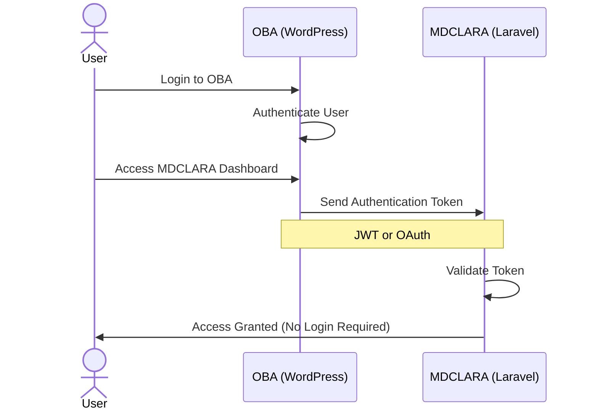
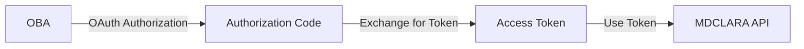
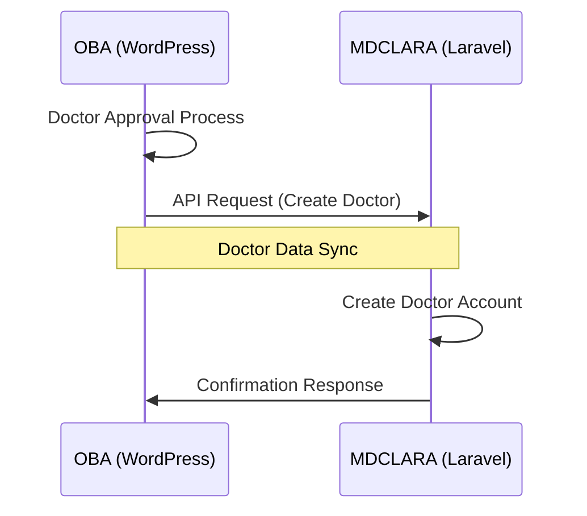
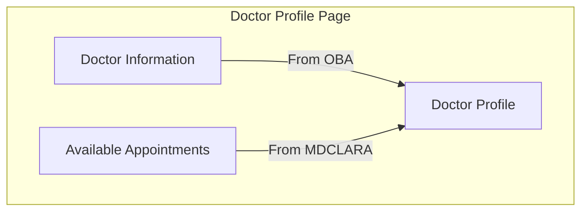
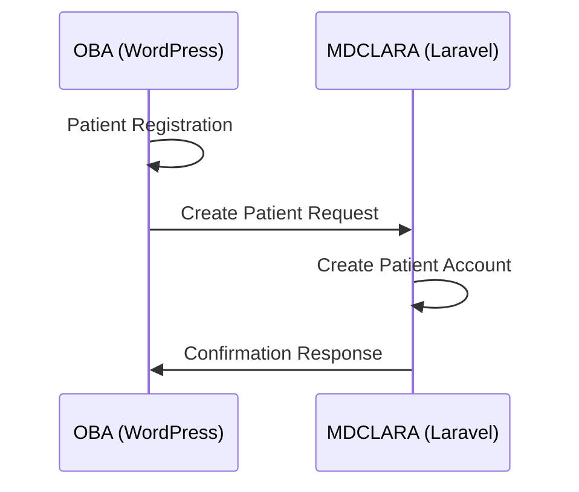
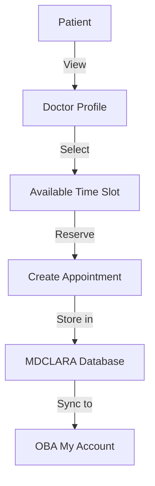
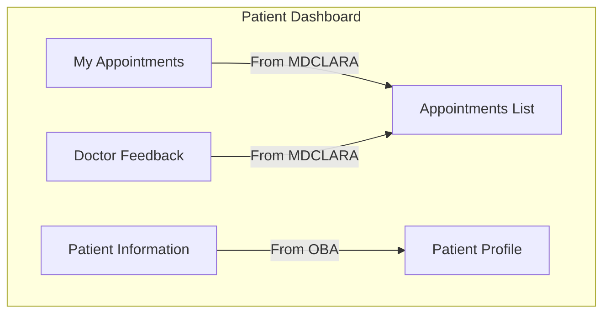
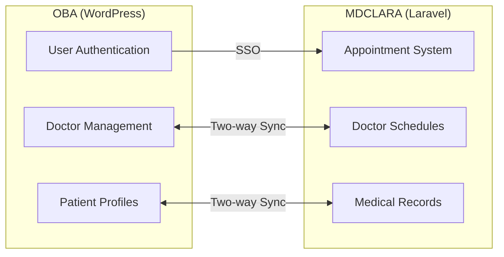

# OBA-MDCLARA System Integration

## 0. SSO Concept

### Approach Options:

**JWT-Based SSO:**

**OAuth-Based SSO:**

## 1. Doctors Integration

### Doctor Profile Page:

## 2. Patients Integration

### Patient Appointment Flow:

### Patient Dashboard:

## Data Flow Architecture

